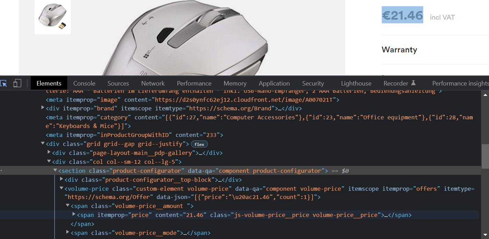
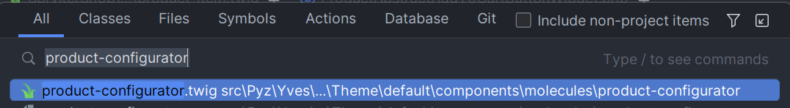

# How to implement molecule and widget

This documentation was created as a result of searching for ready-made and appropriate molecules and widgets, to perform
the task of comparing several products.

## First things first

Before you start creating your own molecule or widget, check if there is already a solution ready for you.
If you see that some element from Frontend meets your requirements in a whole or in a part, try to find it and possibly
use it.

## How to find it?

- For example, we need the price of a product. On the pdp, right-click on the price and select Inspect.



- As you can see, the name product-configurator appears. Let's find out what and where it is. In PHPStorm, double-click
  Shift and enter the name product-configurator.



- After the path you can see that it is a molecule located in src. Most of the molecules also exist in the vendor and
  are overwritten and changed in the src.
- By looking at this molecule, you can see what data it needs

```

```

- And what other molecules and widgets it contains, e.g. the price we are interested in (molecule money-price)

```

```

## Required Data

It is important to know what data molecules and widgets require. Mostly it will be data about the product: name, image,
price, rating, description, attributes, sku, etc.

- If you know abstract ID of the product, you can collect some data (attributes, name, sku, url, description,
  color code, product concrete ID and more) thanks to Client ProductStorageClient with method
  findProductAbstractStorageData()

- Next, this data is mapped and additional data is collected (image, price and rating) thanks to Client
  ProductDetailPageToProductStorageClient with method mapProductStorageData().

- Finally, data is transferred to the twig file, with chosen molecules or widgets.

```



    

```  

## Widget

In fact, the functioning of the widget takes place in three places (by example of AddToCartFormWidget)

1) A twig file, molecule or other widget, i.e. the place where the widget is used

```

```

2) Widget php file. It inherits the class Spryker\Yves\Kernel\Widget\AbstractWidget, so it must have two mandatory
   methods:

- getName() with the name of the widget
- getTemplate() with the path to widget view twig file

Data from place in above 1)

```
args [config, data.product, isDisabled, options]
```

are used in __constructor()

```
public function __construct(array $config, ProductViewTransfer $productViewTransfer, bool $isAddToCartDisabled, array $quantityOptions = [])
    {
        $this->addAddToCartFormParameter();
        $this->addConfigParameter($config);
        $this->addProductParameter($productViewTransfer);
        $this->addIsAddToCartDisabledParameter($isAddToCartDisabled);
        $this->addQuantityOptionsParameter($quantityOptions);
        $this->addFormNamePostfixParameter();

        $this->expandFormWidgetParameters($productViewTransfer);
    }
```

3) Widget template defines the data and uses it

```





    
    
    

    
        {{ form_start(data.form, {
            'action': path('cart/add', {'sku': productSku}),
            'name': 'addToCartForm_' ~ productSku ~ '-' ~ formNamePostfix,
            attr: { class: formClass },
        }) }}
            
        {{ form_end(data.form) }}
    

```

If you create a completely new widget or overwrite the one from the vendor, you still need to save it in
getGlobalWidgets() method in ShopApplicationDependencyProvider.php (src/Pyz/Yves/ShopApplication)

## Useful Molecules and Widgets

1) Molecule image-gallery, needs product.idProductAbstract and product.image data. Display image of the product.
2) Molecule money-price, needs product.price.DEFAULT and product.price.ORIGINAL data. Display original or discounted
   price of the product
3) Molecule rating-selector, needs ratingValue, ratingMaxValue. Display rating of the product.
4) Molecule product-item, needs product data. Display product: name, image, sku, rating and price. Additional add to
   cart and view buttons.
4) Widget ProductDetailPageReviewWidget, needs product.idProductAbstract data. Display product rating with customer
   comments and review form
5) Widget AddToCartFormWidget, needs config, product, isDisabled and options data. Display (only) add to cart button with quantity of product.
