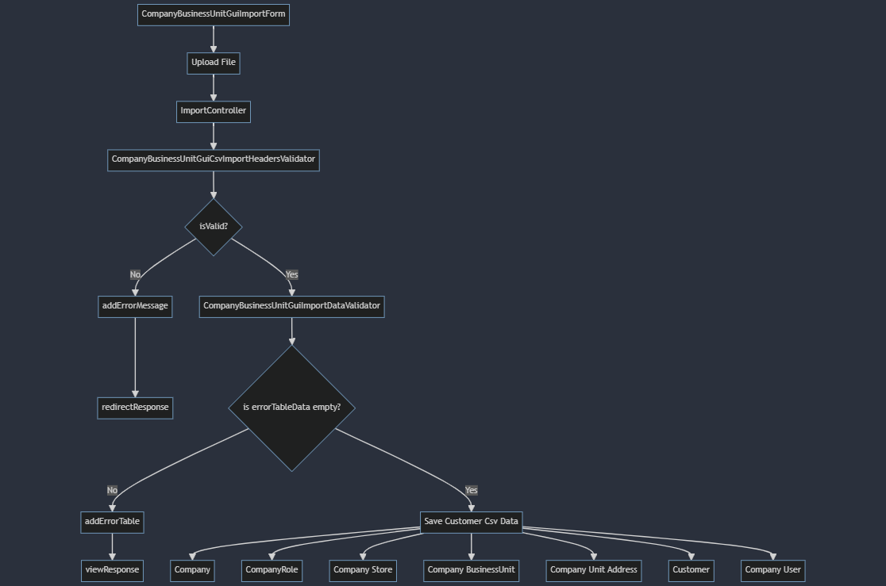

# Upload Company Business Unit via Zed using single CSV file

## Combined company business unit CSV file.

To import company business units via Zed UI, go to Zed panel `Customers->Company Units` and click `Import Company Business Units` button.

Files:

- example valid csv file: [combined_company_business_unit](files/combined_company_bussines_unit.csv)
- example invalid headers file: [combined_company_business_unit_invalid_headers](files/combined_company_bussines_unit_invalid_headers.csv)
- example invalid data file: [combined_company_business_unit_invalid_data](files/combined_company_bussines_unit_invalid_data.csv)

> NOTE! When testing, do not use csv file with bigger rows count than 500. It will take a lot of time to import and
> server timeout error will occur.

## Import Company Business Units via Zed UI.

A diagram showing the general operation of the Company Business Unit import functionality <br>



## Csv file headers validation.

If any predefined header is missing in csv file, error message will be returned with missed headers names. All headers
list is in [Csv file data validation](#csv-file-data-validation) section below.


## Csv file data validation.

> VALIDATION MESSAGES! Every invalid data provided in csv file will be reported with error message with row number and
> header name.


#### 1. `brand_id` column.

* Description:
    - Each brand (company) must have its own unique brand_id. It reflects the key for company in `spy_company`.   
* Field properties & validation rules:
    - the field is required
    - string with max length 255

#### 2. `brand_name` column.

* Description:
    - It reflects the name for company in `spy_company`.
  > NOTE! Brand (Company) having one brand_id (key) but two names will cause the first brand name to be overwritten by the next one.
* Field properties & validation rules:
    - the field is required
    - string with max length 255
      
#### 3. `brand_market` column.

* Description:
    - It defines the market in which the brand (company) exists. It reflects the fk_store for store in `spy_company_store`. 
* Field properties & validation rules:
    - the field is required
    - the store entered must be in the `spy_store table`. Otherwise, an appropriate message will appear
    - the country must be entered according to the ISO 3166-1 alpha-2 code standards
  > NOTE! As the name suggests, market (store) must be entered here, not any country.

#### 4. `brand_active` column.

* Description:
    - Indicates whether the brand (company) is active or not. It reflects the is active for company in `spy_company`.
* Field properties & validation rules:
    - the field is required
    - he only options that can be entered in the fields are `true` and `false`

#### 5. `brand_status` column.

* Description:
    - Specifies whether the brand (company) has been approved, denied or is pending. It reflects the status for company in `spy_company`.
* Field properties & validation rules:
    - the field is required
    - the only options that can be entered in the fields are `approved`, `denied` and `pending`

#### 6. `sold_to_id` column.

* Description:
    - Each Sold To Party must have its own unique sold_to_id. It reflects the key for company business unit in `spy_company_business_unit`. Both Sold To Party and Ship To Party are Company Business Units in Spryker.
* Field properties & validation rules:
    - the field is required
    - string with max length 255
    - If `sold_to_id` occurs without `ship_to_id`, it will be treated as a key for company business unit. However, if it is together with ship_to_id, it will be treated as a parent for this ship_to_id (company business unit). For this reason, company business units should be entered in the hierarchy from the highest to the lowest.
  > NOTE! Be very careful when entering the hierarchy of company business units. For each new company business unit, enter the parent first and then enter its child in a new line

#### 7. `sold_to_name` column.

* Description:
    - Name of the Sold To Party. It reflects the name for company business unit in `spy_company_business_unit`.
* Field properties & validation rules:
    - the field is required
    - string with max length 255

#### 8. `ship_to_id` column.

* Description:
    - Each Ship To Party must have its own unique ship_to_id. It reflects the key for company business unit in `spy_company_business_unit`. Both Ship To Party and Sold To Party are Company Business Units in Spryker.
* Field properties & validation rules:
    - optional
    - string with max length 255
    - `ship_to_id` must have a parent (`sold_to_id`). It cannot exist alone.      

#### 9. `ship_to_name` column.

* Description:
    - Name of the Ship To Party. It reflects the name for company business unit in `spy_company_business_unit`.
* Field properties & validation rules:
    - optional
    - if `ship_to_id` exist, then `ship_to_name` also.
    - string with max length 255

#### 10. `email` column.

* Description:
    - Email of Sold To Party or Ship To Party (Company Business Unit). It reflects the email for company business unit in `spy_company_business_unit`.
* Field properties & validation rules:
    - the field is required
    - string - proper email with max length 255 

#### 11. `address_id` column.

* Description:
    - Each address for Sold To Party or Ship To Party must have its own unique id. It reflects key in `spy_company_unit_address`.
* Field properties & validation rules:
    - the field is required
    - string with max length 255

#### 12. `address_1` column.

* Description:
    - The first part of the address, usually specifying the street. It reflects address1 in `spy_company_unit_address`.
* Field properties & validation rules:
    - the field is required
    - string with max length 255

#### 13. `address_2` column.

* Description:
    - The second (additional) part of the address, usually specifying the streets number. It reflects address2 in `spy_company_unit_address`.
* Field properties & validation rules:
    - optional
    - string with max length 255

#### 14. `address_3` column.

* Description:
    - The third (additional) part of the address. It reflects address3 in `spy_company_unit_address`.
* Field properties & validation rules:
    - optional
    - string with max length 255

#### 15. `country_iso2_code` column.

* Description:
    - Specifies the country in which the Sold To Party or Ship To Party (Company Business Unit) is located. It reflects fk_country in `spy_company_unit_address`.
* Field properties & validation rules:
    - the field is required
    - the country must be entered according to the ISO 3166-1 alpha-2 code standards

#### 16. `state` column.

* Description:
    - Specifies the state in which the Sold To Party or Ship To Party (Company Business Unit) is located.
* Field properties & validation rules:
    - optional
    - string with max length 255

#### 17. `city` column.

* Description:
    - Specifies the city in which the Sold To Party or Ship To Party (Company Business Unit) is located. It reflects city in `spy_company_unit_address`.
* Field properties & validation rules:
    - the field is required
    - string with max length 255

#### 18. `zip_code` column.

* Description:
    - Specifies the zip code of city where the Sold To Party or Ship To Party (Company Business Unit) is located. It reflects zip_code in `spy_company_unit_address`.
* Field properties & validation rules:
    - the field is required
    - numeric with max length 15

#### 19. `phone` column.

* Description:
    - Specifies the phone of the Sold To Party or Ship To Party (Company Business Unit). It reflects phone in `spy_company_unit_address`.
* Field properties & validation rules:    
    - optional

#### 20. `admin_salutation` column.

* Description:
    - Specifies the phrase in which you can address the admin (customer). It reflects salutation in `spy_customer`.
* Field properties & validation rules:
    - the field is required
    - the only options that can be entered in the fields are `Mr`, `Mrs`, `Ms` and `Dr`

#### 21. `admin_first_name` column.

* Description:
    - Admin's first name. It reflects first_name in `spy_customer`.
* Field properties & validation rules:
    - the field is required
    - string with max length 100

#### 22. `admin_last_name` column.

* Description:
    - Admin's last name. It reflects last_name in `spy_customer`.
* Field properties & validation rules:
    - the field is required
    - string with max length 100

#### 23. `admin_email` column.

* Description:
    - Admin's email. It reflects email in `spy_customer`.
* Field properties & validation rules:
    - the field is required
    - string - proper email with max length 255

#### 24. `admin_phone` column.

* Description:
    - Admin's phone. It reflects phone in `spy_customer`.
* Field properties & validation rules:
    - optional

## Technical info

1. Translations for text fields in Zed can be found in `src/Pyz/Zed/Translator/data/CompanyBusinessUnitGui`.
2. A new column `state` has been added in the `spy_company_unit_address` table. The schema file is located in `src/Pyz/Zed/CompanyUnitAddress/Persistence/Propel/Schema`.
3. When creating a company, predefined company roles are automatically created.
4. To run the tests, use these two commands:
```bash
codecept build -c tests/PyzTest/Zed/CompanyBusinessUnitCsvImport
```
```bash
codecept run -c tests/PyzTest/Zed/CompanyBusinessUnitCsvImport
```
