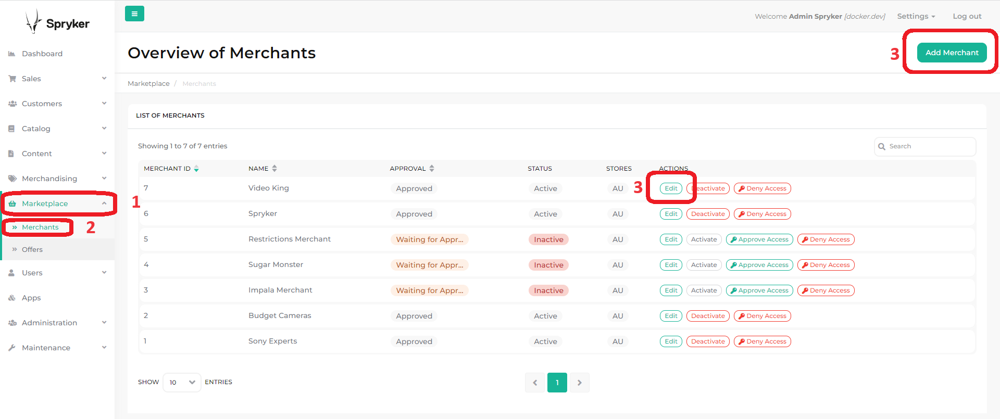

# Enrich merchant with payment specific attributes per store

## Acceptance Criteria:

- Create a new csv file with two attributes: `gr_payment_commission` and `gr_payment_commission_cap`. Attributes are
  assigned to the merchant and store
- Create a new command in the Docker Cli tool that will import data from above csv file to the
  new `pyz_merchant_payment_commission` table
- In the Zed panel, create a new `Payment Commission` tab with a form for editing and adding two attributes

### CSV file

The file is named `merchant_payment_commission.csv` and is located in `data/import/common/AU/marketplace`. Contains
default data for two attributes assigned to merchants and store.

### Command and table in database

The new command is called `merchant-payment-commission` and can be executed from the Docker Cli by
typing:

```bash
console data:import:merchant-payment-commission
```

A new`pyz_merchant_payment_commission` table has been created. Schema for it is located in a
file `spy_merchant.schema.xml` located
in `Pyz/Zed/MerchantPaymentCommission/Persistence/Propel/Schema/pyz_merchant_payment_commission.schema.xml`

```xml
<?xml version="1.0"?>
<database xmlns="spryker:schema-01" xmlns:xsi="http://www.w3.org/2001/XMLSchema-instance" name="zed" xsi:schemaLocation="spryker:schema-01 https://static.spryker.com/schema-01.xsd" namespace="Orm\Zed\MerchantPaymentCommission\Persistence" package="src.Orm.Zed.MerchantPaymentCommission.Persistence">

    <table name="pyz_merchant_payment_commission" identifierQuoting="true" phpName="PyzMerchantPaymentCommission">
        <column name="id_merchant_payment_commission" type="integer" autoIncrement="true" primaryKey="true"/>
        <column name="fk_merchant" type="integer" required="true"/>
        <column name="fk_store" type="integer" required="true"/>
        <column name="gr_payment_commission_key" type="INTEGER" />
        <column name="gr_payment_commission_cap_key" type="INTEGER" />

        <foreign-key foreignTable="spy_merchant" onDelete="CASCADE">
            <reference local="fk_merchant" foreign="id_merchant"/>
        </foreign-key>

        <foreign-key foreignTable="spy_store" onDelete="CASCADE">
            <reference local="fk_store" foreign="id_store"/>
        </foreign-key>

        <behavior name="timestampable"/>
    </table>

</database>
```

### Modify and create Transfer Objects

A new file `merchant_payment_commission.transfer.xml` was created in `Pyz/Shared/MerchantPaymentCommission/Transfer`

A new property has been added to the existing transfer `MerchantTransfer`, which is another
TransferObject - `MerchantPaymentCommissionTransfer`.<br>
Because there may be multiple stores, the values of the two attributes are displayed, saved, and edited for each
specific store. This means that an array with several keys can be given to one merchant. Additionally, the way the form
is constructed means that there must be a separate TransferObject `MerchantPaymentCommissionPerStore` which is an
array.<br>
It, in turn, contains the actual TransferObject `MerchantPaymentCommissionValues` with specific values.

```xml
<?xml version="1.0"?>
<transfers xmlns="spryker:transfer-01" xmlns:xsi="http://www.w3.org/2001/XMLSchema-instance" xsi:schemaLocation="spryker:transfer-01 http://static.spryker.com/transfer-01.xsd">

    <transfer name="Merchant">
        <property name="merchantPaymentCommission" type="MerchantPaymentCommission"/>
    </transfer>

    <transfer name="MerchantPaymentCommission">
        <property name="merchantPaymentCommissionPerStore" type="array"/>
        <property name="fkMerchant" type="int"/>
        <property name="fkStore" type="int"/>
        <property name="grPaymentCommissionKey" type="int"/>
        <property name="grPaymentCommissionCapKey" type="int"/>
        <property name="storeName" type="string"/>
    </transfer>

    <transfer name="MerchantPaymentCommissionPerStore">
        <property name="merchantPaymentCommissionValues" type="MerchantPaymentCommissionValues"/>
    </transfer>

    <transfer name="MerchantPaymentCommissionValues">
        <property name="fkMerchant" type="int"/>
        <property name="fkStore" type="int"/>
        <property name="grPaymentCommissionKey" type="int"/>
        <property name="grPaymentCommissionCapKey" type="int"/>
        <property name="storeName" type="string"/>
    </transfer>

</transfers>
```

### Payment Commission Tab

A new tab in the Zed panel has been created in the Editing and Adding a Merchant Form. Go
to `Markeptlace` -> `Merchants` -> click the button in the Actions column `Edit` or the `Add Merchant` button. Above the
second place, a new `Payment Commission` tab will be visible, containing a form with two fields.


The tab was created as a Plugin in the `MerchantPaymentCommission` module in Zed.

### Payment Commission Form

It is located in the tab with the same name. There are two fields of the `integer` type. Validation
for `Payment Commission` says that the entered value must be of type `integer`, greater than or equal to `0`, less than
or equal to `100`

```php
'constraints' => [
                new Type([
                    'type' => 'integer',
                    'message' => 'The value {{ value }} is not a valid {{ type }}',
                ]),
                new LessThanOrEqual([
                    'value' => 100,
                    'message' => 'This value should be less than or equal to {{ compared_value }}',
                ]),
                new GreaterThanOrEqual([
                    'value' => 0,
                    'message' => 'This value should be greater than or equal to {{ compared_value }}',
                ]),
            ],
```

Validation for `Payment Commission Cap` says that the entered value must be of type `integer`, greater than or equal
to `0`, less than or equal to `2147483647`. This large number is the maximum value that an integer can take.

```php
'constraints' => [
                new Type([
                    'type' => 'integer',
                    'message' => 'The value {{ value }} is not a valid {{ type }}',
                ]),
                new LessThanOrEqual([
                    'value' => 2147483647,
                    'message' => 'This value should be less than or equal to {{ compared_value }}',
                ]),
                new GreaterThanOrEqual([
                    'value' => 0,
                    'message' => 'This value should be greater than or equal to {{ compared_value }}',
                ]),
            ],
```

## Displaying

Because the task concerns, among others, displaying values by store. There must be several fields on the form to fill
in - each for a different store. However, Twig has a protection that prevents the same field from being rendered
multiple times. The solution is to write the form field in the code outside the foreach loop (in Twig it is `for`), and
to put the values (even empty) of two attributes into the loop itself. Importantly, the form field names and value names
must be different (in this case they are: `gr_payment_commission_key` and `gr_payment_commission_cap_key` for fields
names, but for values names `grPaymentCommissionKey` and `grPaymentCommissionCapKey`).<br>
The next necessary step was to place several forms inside one another. This was done due to the fact that an array of
objects is inserted into the form. One of the forms accepts the second form as input (`entry_type`), the second form is
adding the third form (no longer as input), and the third form accepts the appropriate data with stricter types.<br><br>
Please note that in the first form the fields are hidden (`HiddenType` class), and in the configureOptions() method
there is MerchantPaymentCommission TransferObject. The second form lacks the fields and the above configureOptions()
method. The third, most important, form has values from TransferObject instead of fields!

## Steps

It is very important to first create new table, and only then fill it with data and create a new TransferObjects.

In Docker Cli tool (`docker/sdk cli`) type:

1) `console propel:install`
2) `console data:import:merchant-payment-commission`
3) `console transfer:generate`

## Tests

The tests check whether `MerchantPaymentCommission` can be created, edited and found as existing in the table in the
database.

To run test go to docker/sdk cli with test mode

```shell
docker/sdk cli -t
```

First, create necessary testing class:
```shell
codecept build -c tests/PyzTest/Zed/MerchantPaymentCommission/
```

Now create Data Builders:
```shell
console transfer:databuilder:generate
```

Then type: `codecept run -c tests/PyzTest/Zed/MerchantPaymentCommission/`
```shell
codecept run -c tests/PyzTest/Zed/MerchantPaymentCommission/
```

## Troubleshooting

If the new attribute values do not appear with the two columns in the Zed panel, you should clear the
cache `console cache empty-all`
