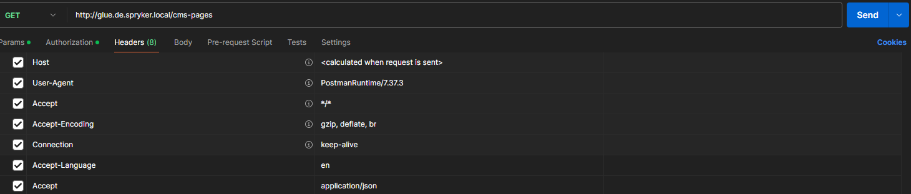
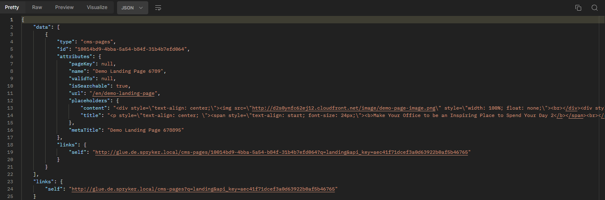

# CMS Page content available for API

Spryker offers two endpoints, one for listing all CMS Pages `cms-pages` and the other for displaying one specific page based on the given cmPageId `cms-pages/{cmPageId}`

## List of all cms pages
The Endpoint is:
`http://glue.de.spryker.local/cms-pages`

Required parameters are:
- Accept-Language (not locale, but language)
- Accept



## List of all cms pages with query
There is an option to narrow the search for the list of CMS Pages by adding the `q` parameter directly to URL.<br>
For example, if we want to find the Demo Landing Page, we can add the `q=landing` parameter <br>
`http://glue.de.spryker.local/cms-pages?q=landing`

## Retrieving CMS Page by uuid
Having a list of CMS pages, we can know the uuid of a given CMS page, which we then add as another parameter to the URL.<br>
For example: `http://glue.de.spryker.local/cms-pages/10014bd9-4bba-5a54-b84f-31b4b7efd064` <br>
The CMS Page found in this way has all the data except the `content` and `metaTitle`.

## Add content and metaTitle
To solve this problem, just add 2 properties to `RestCmsPagesAttributesTransfer`. In the newly created file:
`src/Pyz/Shared/CmsPagesRestApi/Transfer/cms_pages_rest_api.transfer.xml` type:
```xml
<?xml version="1.0"?>
<transfers xmlns="spryker:transfer-01" xmlns:xsi="http://www.w3.org/2001/XMLSchema-instance"
           xsi:schemaLocation="spryker:transfer-01 http://static.spryker.com/transfer-01.xsd">
    <transfer name="RestCmsPagesAttributes">
        <property name="placeholders" type="array" singular="placeholder"/>
        <property name="metaTitle" type="string"/>
    </transfer>
</transfers>
```
Endpoint with uuid CMS Page now returns content and metaTitle<br>

